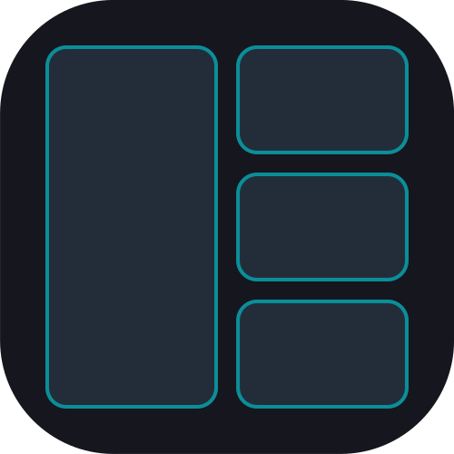

# Raven Tiling Emulator 🐦


<p align="center">
  
</p>


Raven es un gestor de ventanas dinámico (Tiling Window Manager) diseñado específicamente para **KDE Plasma 6 (Wayland)**. Con la llegada de la **versión 2.5**, Raven alcanza su madurez tecnológica al consolidarse como una solución **100% nativa en Rust** y sumar capacidades de gestión multimonitor inteligente.

## 🚀 El Salto a la Versión 2.5: Robustez y Multimonitor
Esta versión fortalece la arquitectura introducida en la 2.0 y añade características de resiliencia avanzadas. El motor matemático es ahora capaz de auto-preservarse frente a sobrecargas del usuario.

### 📉 Eficiencia Energética y de Memoria
La optimización sigue siendo el pilar. El motor opera con recursos ridículamente bajos:

| Versión | Arquitectura | Consumo de RAM (aprox.) |
|---|---|---|
| **v1.0** | Python Puro | 55.0 MB |
| **v1.6** | Híbrida (Python + Rust FFI) | ~25.9 MB |
| **v2.5** | **Native All-Rust Edition** | **~6.0 MB** |

*Una reducción inmensa en el uso de memoria comparado con las primeras versiones.*

## 🌟 Nuevas Funciones y Mejoras
- **Migración Inteligente (Layout Exhaustion):** El motor detecta matemáticamente cuando una pantalla se satura (si el área de una ventana cae por debajo del 8%). Las ventanas excedentes son propulsadas automáticamente a tu monitor secundario o al siguiente escritorio virtual. ¡Adiós a los mosaicos ilegibles!
- **Blindaje del IPC y Motor Geométrico:** El puente DBus ahora rechaza payloads corruptos, maneja desconexiones asíncronas seguras y limita las colas de eventos en memoria.
- **Control de Migración Manual:** Nuevos botones reactivos en el Plasmoid para trasladar la ventana actual entre monitores y escritorios virtuales con un clic.
- **Motor de Topología Global Nativo:** El daemon procesa eventos de forma directa y asíncrona mediante `zbus`.

## 🏗️ Nueva Estructura del Proyecto
- `core/engine_rs/`: El corazón del proyecto. Un daemon nativo asíncrono que escucha al compositor KWin.
- `raven_gui/`: Aplicación de preferencias nativa basada en egui para una configuración visual fluida.
- `adapters/`: 
    - `kwin_script/`: Bridge liviano en JavaScript para la API de Plasma 6.
    - `plasmoid/`: Widget de Plasma para el control rápido del estado del motor.
- `bin/`: Directorio de destino para los binarios optimizados una vez instalados.

## 🛠️ Instalación y Uso
El nuevo instalador gestiona la descarga de crates de Rust y la compilación optimizada de los componentes nativos.

1. Clona el repositorio.
2. Ejecuta `./install.sh`.
3. Activa "Raven Bridge" en la configuración de KWin (Scripts de KWin).

```bash
git clone https://github.com/Vidruck/raven
cd raven
./install.sh
```

## 🧹 Desinstalación
Si deseas eliminar Raven y todos sus binarios, ejecuta:
`./uninstall.sh`

### Atajos Predeterminados
| Tecla | Acción |
|---|---|
| `Meta + I / D` | Incrementar/Disminuir ventanas maestras |
| `Meta + L / H` | Ajustar ratio del área maestra (Ancho) |
| `Meta + J / K` | Cambiar foco entre ventanas del stack |
| `Meta + G` | Alternar (Toggle) el motor de mosaico globalmente |

## ⚠️ Descargo de Responsabilidad (Disclaimer)
**Este software se proporciona "tal cual" (AS IS), sin garantía de ningún tipo.** Raven interactúa directamente con el compositor de ventanas (KWin) y el bus de datos del sistema (DBus). El usuario asume toda la responsabilidad derivada de su uso. El autor no se hace responsable de inestabilidades en la sesión gráfica o conflictos con otros scripts del sistema.

---
**Si este proyecto te es útil, considera ayudarme a mejorarlo con feedback o contribuciones. ¡Huélum!**

*Desarrollado por Alejandro González Hernández (Vidruck). Licencia GPL-3.*